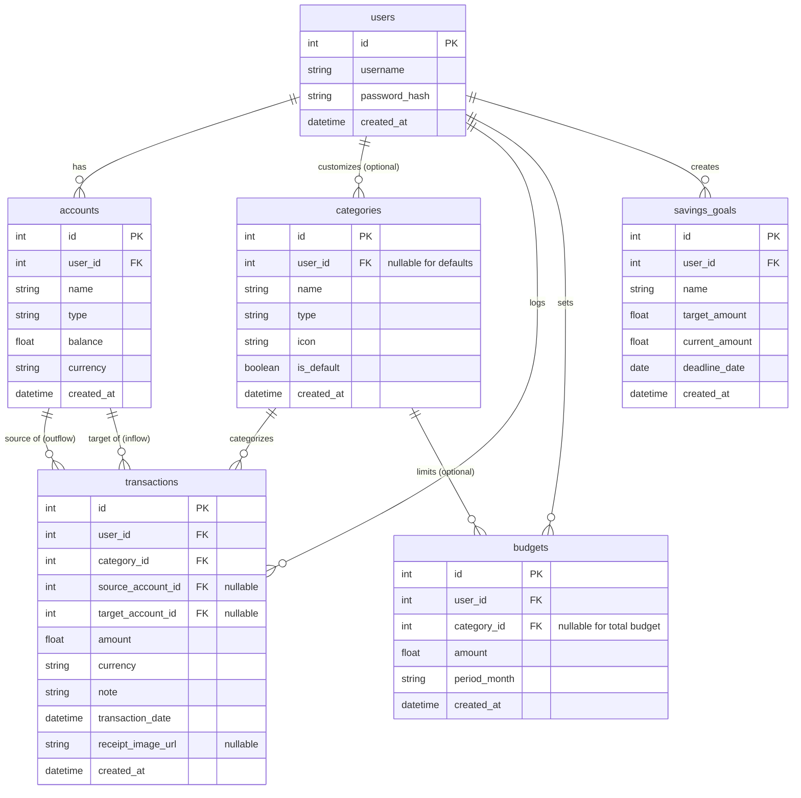

# 資料庫設計 - 個人記帳簿系統

本文件基於 PRD 與系統架構設計，定義了系統後端 SQLite 資料庫的 Schema，包含 ER 圖實體關聯模型與資料表欄位詳細說明。

---

## 1. ER 圖（實體關係圖）

---

## 2. 資料表詳細說明

### `users` (使用者表)
紀錄使用者的登入資訊與密碼雜湊。
- `id` (INTEGER): Primary Key。
- `username` (TEXT): 使用者登入帳號，必填且唯一。
- `password_hash` (TEXT): 經過加密的密碼，必填。
- `created_at` (DATETIME): 帳號建立時間。

### `accounts` (帳戶表)
儲存使用者的各種資金帳戶，如現金、銀行、信用卡等。
- `id` (INTEGER): Primary Key。
- `user_id` (INTEGER): Foreign Key，對應 `users.id`。
- `name` (TEXT): 帳戶名稱 (如「國泰世華」、「我的錢包」)，必填。
- `type` (TEXT): 帳戶類型 (如 `cash`, `bank`, `credit`, `mobile_pay`)，必填。
- `balance` (REAL): 帳戶當前餘額，預設為 0.0。
- `currency` (TEXT): 幣別 (如 `TWD`, `USD`)，預設為 TWD。
- `created_at` (DATETIME): 建立時間。

### `categories` (收支分類表)
紀錄花費與收入的類別。系統可提供預設值，使用者也可自定義。
- `id` (INTEGER): Primary Key。
- `user_id` (INTEGER): Foreign Key，對應 `users.id`。允許 NULL（代表系統預設類別）。
- `name` (TEXT): 類別名稱 (如「餐飲」、「薪資」)，必填。
- `type` (TEXT): 類型 (如 `income`, `expense`)，必填。
- `icon` (TEXT): 前端顯示的圖示名稱，選填。
- `is_default` (BOOLEAN): 是否為系統預設類別，預設為 False。
- `created_at` (DATETIME): 建立時間。

### `transactions` (交易紀錄表) - 核心借貸設計
實作會計邏輯的核心，紀錄每一筆資金流動。
- `id` (INTEGER): Primary Key。
- `user_id` (INTEGER): Foreign Key，對應 `users.id`。
- `category_id` (INTEGER): Foreign Key，對應 `categories.id`。
- `source_account_id` (INTEGER): Foreign Key，對應 `accounts.id`。資金來源帳戶 (流出)。可為 NULL (代表外部收入)。
- `target_account_id` (INTEGER): Foreign Key，對應 `accounts.id`。資金目的帳戶 (流入)。可為 NULL (代表單純支出)。
- `amount` (REAL): 交易金額，必填。
- `currency` (TEXT): 幣別，預設 TWD。
- `note` (TEXT): 備註說明，選填。
- `transaction_date` (DATETIME): 交易發生時間，必填。
- `receipt_image_url` (TEXT): 發票或收據圖片路徑 (未來 OCR 用)，選填。
- `created_at` (DATETIME): 建立時間。

### `budgets` (預算設定表)
設定每月總預算或特定類別預算。
- `id` (INTEGER): Primary Key。
- `user_id` (INTEGER): Foreign Key，對應 `users.id`。
- `category_id` (INTEGER): Foreign Key，對應 `categories.id`。若為 NULL 則代表「總預算」。
- `amount` (REAL): 預算金額限制，必填。
- `period_month` (TEXT): 適用月份 (格式如 `2026-04`)，必填。
- `created_at` (DATETIME): 建立時間。

### `savings_goals` (儲蓄目標表)
設定存錢目標與進度。
- `id` (INTEGER): Primary Key。
- `user_id` (INTEGER): Foreign Key，對應 `users.id`。
- `name` (TEXT): 目標名稱 (如「買車」、「旅遊」)，必填。
- `target_amount` (REAL): 目標金額，必填。
- `current_amount` (REAL): 目前已存金額，預設 0.0。
- `deadline_date` (DATE): 預計達成日期，選填。
- `created_at` (DATETIME): 建立時間。
