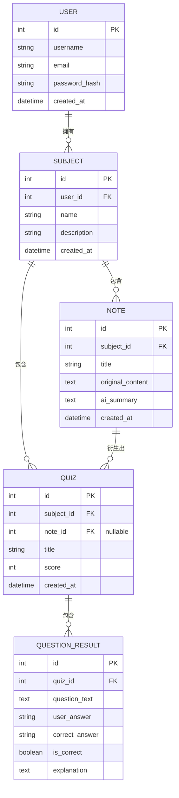

# 資料庫設計文件 - AI 學習助理平台

基於產品需求文件 (PRD) 與流程圖 (FLOWCHART)，以下規劃本專案的 SQLite 資料庫 Schema 設計。根據架構文件，我們採用 Flask-SQLAlchemy 處理資料庫互動。

## 1. ER 圖（實體關係圖）

## 2. 資料表詳細說明

### USER (使用者表)
紀錄註冊使用者的基本資料與登入憑證。
- `id` (INTEGER, PK): 使用者唯一 ID
- `username` (VARCHAR(50)): 顯示名稱
- `email` (VARCHAR(120)): 登入信箱 (必填, 唯一)
- `password_hash` (VARCHAR(256)): 密碼雜湊值
- `created_at` (DATETIME): 建立時間

### SUBJECT (科目表)
每個使用者可以自訂多個不同科目來分類學習內容。
- `id` (INTEGER, PK): 科目唯一 ID
- `user_id` (INTEGER, FK): 關聯至 USER.id
- `name` (VARCHAR(100)): 科目名稱 (例如：高中數學)
- `description` (TEXT): 簡單描述
- `created_at` (DATETIME): 建立時間

### NOTE (筆記表)
存放上傳的重點講義內容以及 AI 歸納出來的摘要。
- `id` (INTEGER, PK): 筆記唯一 ID
- `subject_id` (INTEGER, FK): 關聯至 SUBJECT.id
- `title` (VARCHAR(150)): 筆記標題 (如檔名)
- `original_content` (TEXT): 原始擷取的文本內容
- `ai_summary` (TEXT): AI 解析後產生的結構化筆記
- `created_at` (DATETIME): 建立時間

### QUIZ (測驗表)
針對某個科目或某份筆記所產生的整份測驗紀錄。
- `id` (INTEGER, PK): 獨一測驗 ID
- `subject_id` (INTEGER, FK): 關聯至 SUBJECT.id
- `note_id` (INTEGER, FK, Nullable): 若針對某筆記出題則有關聯
- `title` (VARCHAR(150)): 測驗標題
- `score` (INTEGER): 得分
- `created_at` (DATETIME): 測驗時間

### QUESTION_RESULT (錯題/答題紀錄表)
紀錄每一次測驗中的各題答題狀況，作為未來**弱點分析**的主要資料來源。
- `id` (INTEGER, PK): 唯一 ID
- `quiz_id` (INTEGER, FK): 關聯至 QUIZ.id
- `question_text` (TEXT): 題目內容
- `user_answer` (VARCHAR(255)): 使用者選擇/填寫的答案
- `correct_answer` (VARCHAR(255)): 正確答案
- `is_correct` (BOOLEAN): 是否答對
- `explanation` (TEXT): 題目詳解或 AI 解析
