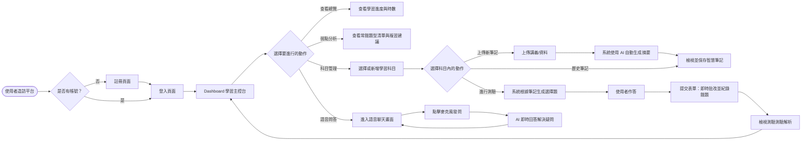
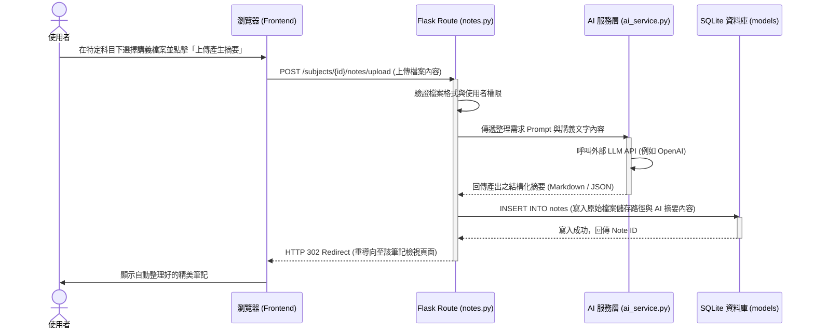

# 流程圖文件 - AI 學習助理平台

這份文件基於產品需求文件 (PRD) 與系統架構文件 (ARCHITECTURE)，透過視覺化的方式呈現使用者的完整操作路徑、系統內部處理資料的流程，並梳理出系統初期的路由對照表。

## 1. 使用者流程圖 (User Flow)

此流程圖展示了使用者在平台上進行主要操作（如上傳筆記、進行測驗與語音問答）時的頁面跳轉與決策路徑。

## 2. 系統序列圖 (Sequence Diagram)

這裡我們以 **「上傳筆記並生成 AI 摘要」** 為例，描繪系統後端與資料庫、AI 服務層之間的詳細互動序列。

## 3. 功能清單對照表

以下為平台核心功能的 URL 路由對應。設計上依循 RESTful 風格，以資源標的（如 auth, dashboard, subjects, notes）作為區分，實作時這些路由可被註冊在不同的 Flask Blueprints 之下。

| 功能模組 | 操作描述 | URL 路徑 | HTTP 方法 | 對應角色 |
| --- | --- | --- | --- | --- |
| **首頁與認證** | 平台登陸介紹頁 | `/` | GET | 訪客 |
| | 使用者註冊 | `/auth/register` | GET / POST | 訪客 |
| | 使用者登入 | `/auth/login` | GET / POST | 訪客 |
| **學習主控台** | 總覽學習進度與時數 | `/dashboard` | GET | 已登入使用者 |
| | 檢視弱點分析與錯題本 | `/dashboard/weaknesses` | GET | 已登入使用者 |
| **科目與筆記** | 檢視所有科目 | `/subjects` | GET | 已登入使用者 |
| | 新增單一科目 | `/subjects/create` | GET / POST | 已登入使用者 |
| | 檢視特定科目下的筆記清單 | `/subjects/<id>/notes` | GET | 已登入使用者 |
| | 上傳講義與生成 AI 摘要 | `/subjects/<id>/notes/upload` | GET / POST | 已登入使用者 |
| | 閱讀/編輯單篇筆記摘要 | `/notes/<note_id>` | GET / POST | 已登入使用者 |
| **自動測驗** | 特定科目的測驗紀錄 | `/subjects/<id>/quizzes` | GET | 已登入使用者 |
| | 開始測驗（AI 出題與交卷） | `/subjects/<id>/quizzes/start` | GET / POST | 已登入使用者 |
| | 查看測驗解析與分數 | `/quizzes/<quiz_id>` | GET | 已登入使用者 |
| **語音互動** | 進入語音問答聊天頁面 | `/voice/qa` | GET | 已登入使用者 |
| | 供前端發送語音轉文字做非同步問答 | `/api/voice/ask` | POST | 內部 API (JS Fetch) |
