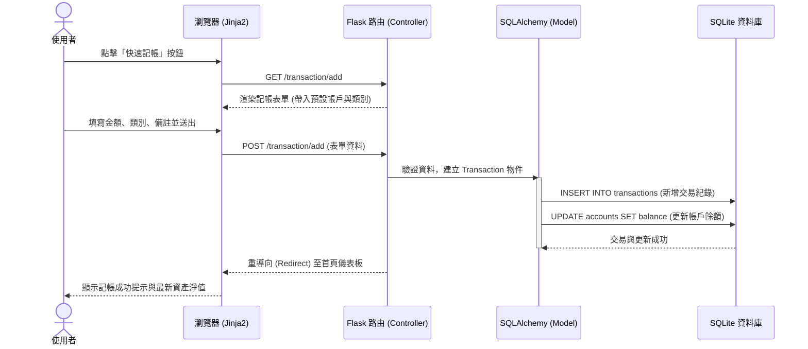

# 流程圖設計 - 個人記帳簿系統

本文件根據 [PRD.md](PRD.md) 的需求與 [ARCHITECTURE.md](ARCHITECTURE.md) 的架構設計，視覺化了使用者的操作路徑（User Flow）、系統的核心互動流程（Sequence Diagram），並整理了初步的功能與路由對照表。

---

## 1. 使用者流程圖（User Flow）

此流程圖展示了使用者登入系統後，在各個主要功能模組之間的操作路徑。系統以「首頁儀表板」為核心樞紐，向外輻射各項子功能。

```mermaid
flowchart LR
    Start([使用者進入系統]) --> Auth{是否已解鎖?}
    Auth -->|否| Login[輸入密碼/生物解鎖]
    Login --> Dashboard
    Auth -->|是| Dashboard[首頁儀表板<br/>(資產總覽/快速記帳鍵)]
    
    Dashboard --> Action{選擇操作}
    
    Action -->|點擊快速記帳| AddTx[填寫金額/類別/備註]
    AddTx --> SaveTx[儲存交易紀錄]
    SaveTx --> Dashboard
    
    Action -->|查看明細| TxList[歷史明細列表]
    TxList --> FilterTx[搜尋與過濾]
    TxList --> EditTx[編輯/刪除特定紀錄]
    EditTx --> SaveTx
    
    Action -->|財務分析| Report[報表與圖表頁面]
    Report --> ViewCharts[切換圓餅圖/折線圖]
    Report --> Export[匯出 CSV/Excel]
    
    Action -->|系統設定| Settings[設定中心]
    Settings --> ManageAcc[帳戶管理<br/>新增/編輯帳戶]
    Settings --> ManageCat[類別管理<br/>自定義收支標籤]
    Settings --> ManageBudget[預算與儲蓄目標設定]
```

---

## 2. 系統序列圖（Sequence Diagram）

此序列圖以本系統最核心的 **「快速記帳」** 流程為例，展示了從使用者操作到資料寫入資料庫的完整技術流動。此流程也體現了隱含「借貸法則」的設計，透過更新帳戶餘額來維持資產平衡。



---

## 3. 初步功能清單與路由對照表

根據架構中的藍圖 (Blueprints) 規劃，初步對應的 URL 路徑如下，這些路由設計將作為接下來的 API 開發基礎：

| 功能模組 | 功能描述 | URL 路徑 | HTTP 方法 |
| :--- | :--- | :--- | :--- |
| **Auth** | 密碼解鎖/登入畫面 | `/auth/login` | GET, POST |
| **Auth** | 登出/鎖定系統 | `/auth/logout` | GET |
| **Dashboard** | 首頁儀表板 (總覽) | `/dashboard` 或 `/` | GET |
| **Transaction**| 顯示快速記帳表單 | `/transaction/add` | GET |
| **Transaction**| 處理新增交易邏輯 | `/transaction/add` | POST |
| **Transaction**| 歷史明細列表與過濾 | `/transaction/list` | GET |
| **Transaction**| 編輯/刪除特定交易 | `/transaction/<id>/edit` | GET, POST |
| **Report** | 報表總覽 (圓餅/折線圖) | `/report` | GET |
| **Report** | 匯出財務資料 | `/report/export` | GET |
| **Settings** | 帳戶列表與新增 | `/settings/accounts` | GET, POST |
| **Settings** | 收支類別與標籤管理 | `/settings/categories` | GET, POST |
| **Settings** | 預算與目標設定 | `/settings/budgets` | GET, POST |
